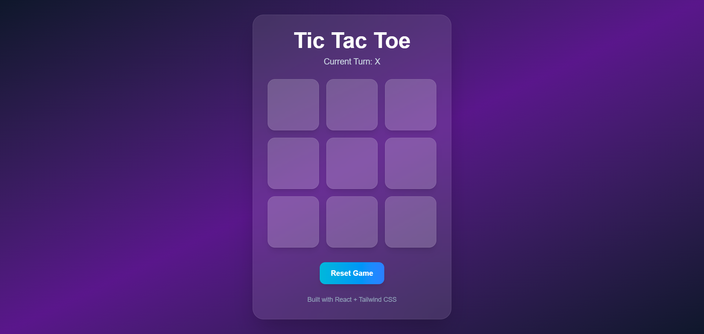

# 🎮 Tic Tac Toe Game

A modern and interactive Tic Tac Toe game built using React and Tailwind CSS.

## 🚀 Live Demo

Add your deployed link here:

```bash
https://x-o-weld.vercel.app
```

---

## 📌 Features

* ✅ 3x3 Interactive Game Board
* ✅ Two Player Turn System
* ✅ Winner Detection
* ✅ Draw Detection
* ✅ Winning Square Highlight
* ✅ Reset Game Functionality
* ✅ Responsive Design
* ✅ Modern Glassmorphism UI
* ✅ Smooth Hover Animations

---

## 🛠️ Tech Stack

* React
* Vite
* Tailwind CSS

---

## 📂 Project Structure

```bash
src/
│
├── components/
│   ├── Board.jsx
│   └── Square.jsx
│
├── utils/
│   └── calculateWinner.js
│
├── App.jsx
└── index.css
```

---

## ⚙️ Installation & Setup

Clone the repository:

```bash
git clone https://github.com/mudassir-jmi/x-o
```

Navigate into the project folder:

```bash
cd x-o
```

Install dependencies:

```bash
npm install
```

Run the development server:

```bash
npm run dev
```

---

## 🎯 How to Play

* Player X starts first
* Players take turns placing X and O
* First player to align 3 symbols wins
* If all squares are filled without a winner, the game ends in a draw

---

## 📸 Screenshots

Add screenshots here.



---

## 🌐 Deployment

This project is deployed using Vercel.

### Deploy Steps

1. Push code to GitHub
2. Go to Vercel
3. Import GitHub repository
4. Click Deploy

---

## 📚 Learning Outcomes

Through this project, I learned:

* React component structure
* State management using useState
* Conditional rendering
* Game logic implementation
* Tailwind CSS styling
* Responsive UI design

---

## 👨‍💻 Author

Made with ❤️ by Md Mudassir Akhter
